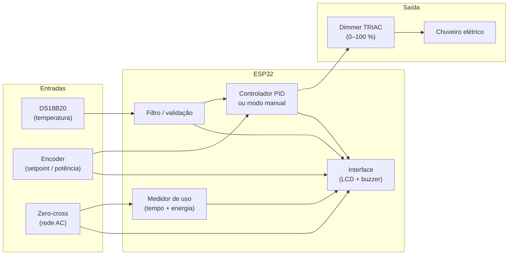

# Controle de Temperatura — ESP32 + PID + Dimmer TRIAC

Firmware embarcado para **regulação de temperatura de chuveiro elétrico** com malha fechada **PID**, atuador de potência por **corte de fase (TRIAC)**, interface local via **LCD 20×4 I2C** e **encoder rotativo**, e feedback sonoro por **buzzer**.

Desenvolvido para placa **ESP32** (referência de fiação: **NodeMCU-32S** / ESP-WROOM-32). Compatível com **PlatformIO** e **Arduino IDE** (core Arduino-ESP32 **3.x**).


*Interface em operação: cronômetro, consumo acumulado (kWh), setpoint, temperatura atual, potência do dimmer e indicador Temp OK.*

Para **detalhes técnicos ampliados** — teoria da malha PID, calibração, dimensionamento elétrico, arquitetura do firmware e resultados de bancada — consulte o artigo em PDF:

**[Controle de Temperatura por Malha PID Embarcada - ESP32.pdf](Controle%20de%20Temperatura%20por%20Malha%20PID%20Embarcada%20-%20ESP32.pdf)**

---

## Sumário

- [Documentação detalhada (PDF)](#documentação-detalhada-pdf)
- [Características](#características)
- [Visão geral do sistema](#visão-geral-do-sistema)
- [Hardware](#hardware)
- [Pinagem (GPIO)](#pinagem-gpio)
- [Instalação e compilação](#instalação-e-compilação)
- [Testes de hardware](#testes-de-hardware)
- [Interface do usuário](#interface-do-usuário)
- [Arquitetura do software](#arquitetura-do-software)
- [Configuração (`config.h`)](#configuração-configh)
- [Depuração serial](#depuração-serial)
- [Segurança](#segurança)
- [Estrutura do repositório](#estrutura-do-repositório)

---

## Documentação detalhada (PDF)

O repositório inclui um artigo técnico completo sobre o projeto:

| Documento | Conteúdo |
|-----------|----------|
| [**Controle de Temperatura por Malha PID Embarcada - ESP32.pdf**](Controle%20de%20Temperatura%20por%20Malha%20PID%20Embarcada%20-%20ESP32.pdf) | Fundamentos do PID embarcado, escolha de componentes, esquema de ligação, calibração dos ganhos, testes práticos e considerações de segurança elétrica |

O `README.md` resume instalação, pinagem e uso do firmware; o PDF aprofunda o **projeto como um todo** (hardware + controle + validação).

---

## Características

| Área | Detalhe |
|------|---------|
| **Controle** | Malha PID contínua (não pausa na meta); modo alternativo de **potência manual** (0–100 %) |
| **Atuador** | RobotDyn AC Light Dimmer + biblioteca **rbdimmerESP32** (TRIAC, zero-cross) |
| **Sensor** | DS18B20 assíncrono (11 bits, ~380 ms), filtro e validação de leituras |
| **Interface** | LCD 20×4 I2C, encoder KY-040, buzzer ativo |
| **Monitoramento** | Cronômetro de uso e energia integrada (∫P·dt) com detecção de rede via zero-cross |
| **Segurança** | Modo seguro em falha de sensor; desligamento automático por inatividade (40 min); boot em standby |
| **Loop** | Arquitetura não bloqueante — tarefas periódicas independentes, sem `delay()` no `loop()` |

---

## Visão geral do sistema



O PID produz uma saída normalizada **0,0–1,0**, convertida em **0–100 %** de potência no dimmer. A histerese de temperatura (`BUZZER_HISTERESE_C`) afeta **apenas** o buzzer, o backlight e o indicador **Temp OK** no LCD — a malha continua regulando dentro da faixa.

Ganhos PID calibrados no projeto irmão [`Malha_PID_temperatura`](../Malha_PID_temperatura) (portados de `pid_controller.py`):

| Parâmetro | Valor |
|-----------|-------|
| Kp | 0,030 |
| Ki | 0,001 |
| Kd | 0,270 |

---

## Hardware

### Componentes principais

| Item | Modelo / tipo | Função |
|------|---------------|--------|
| Microcontrolador | ESP32 (NodeMCU-32S) | Processamento e I/O |
| Sensor | DS18B20 (à prova d'água) | Temperatura da água |
| Atuador | RobotDyn AC Light Dimmer | Corte de fase TRIAC (BTA41) |
| Display | LCD 20×4 + PCF8574 (I2C) | Interface visual |
| Encoder | KY-040 ou equivalente | Ajuste de setpoint / potência |
| Buzzer | Ativo (3,3 V) | Feedback sonoro |
| Pull-up | 4,7 kΩ | Barramento 1-Wire do DS18B20 |

### Alimentação

| Periférico | Tensão |
|------------|--------|
| DS18B20, encoder, buzzer, lógica do dimmer | **3,3 V** |
| LCD I2C | **5 V** ou **3,3 V** (conforme módulo) |
| Chuveiro (potência) | **Rede AC** — via dimmer TRIAC |

> **Atenção:** o dimmer atua na **linha de potência** do chuveiro. Nunca conecte GPIO diretamente à tensão de rede.

### GPIO a evitar no ESP32

Pinos reservados ou restritos: **0**, **2**, **15** (boot), **6–11** (flash SPI), **34–39** (somente entrada).

---

## Pinagem (GPIO)

Valores definidos em [`config.h`](config.h). Diagrama de referência: `imagens/Imagem pinos ESP32.png` (se disponível no repositório).

| Função | GPIO | Observação |
|--------|------|------------|
| DS18B20 (DQ) | 4 | Pull-up **4,7 kΩ** entre DQ e 3,3 V |
| Dimmer ZC (zero-cross) | 5 | Detecção de cruzamento por zero |
| Dimmer PSM (disparo TRIAC) | 18 | Gate do TRIAC |
| I2C SDA (LCD) | 21 | |
| I2C SCL (LCD) | 22 | |
| Encoder CLK (A) | 25 | `INPUT_PULLUP` |
| Encoder DT (B) | 26 | |
| Encoder SW (botão) | 27 | Pressionado = GND |
| Buzzer | 32 | Terminal (−) em GND |

**LCD I2C:** endereço padrão **0x27** (`LCD_ENDERECO_I2C`; alternativa comum **0x3F** — use `teste_lcd` para descobrir). Layout PCF8574 **YWROBOT** (`LCD_LAYOUT_YWROBOT = 1`).

---

## Instalação e compilação

### Pré-requisitos

- [PlatformIO](https://platformio.org/) **ou** [Arduino IDE](https://www.arduino.cc/en/software) com suporte ESP32
- Cabo USB para gravação
- Core **Arduino-ESP32 3.x** (obrigatório para `rbdimmerESP32`)

### PlatformIO (recomendado)

O arquivo [`platformio.ini`](platformio.ini) define o ambiente `esp32dev` com **pioarduino** (Arduino-ESP32 3.x), monitor serial a **115200** baud e upload a **921600** baud.

```bash
# Compilar e gravar
pio run -t upload

# Monitor serial
pio device monitor -b 115200
```

**Ambientes de curva do dimmer** (sobrescrevem `DIMMER_CURVA_TIPO` sem editar `config.h`):

```bash
pio run -e esp32dev_curva_linear -t upload   # linear
pio run -e esp32dev_curva_rms     -t upload   # RMS (carga resistiva)
pio run -e esp32dev_curva_log     -t upload   # logarítmica
```

Dependências declaradas: **OneWire**, **DallasTemperature**, **LiquidCrystal I2C** (marcoschwartz), **rbdimmerESP32**.

> Por padrão, o `platformio.ini` compila com `LCD_USA_NEW_LIQUIDCRYSTAL=0` (marcoschwartz). Para o mesmo LCD da Arduino IDE (**NewLiquidCrystal** + layout YWROBOT), instale a biblioteca correspondente e defina `LCD_USA_NEW_LIQUIDCRYSTAL = 1` em `config.h`.

### Arduino IDE

#### 1. Suporte ESP32

**Ferramentas → Placa → Gerenciador de placas** → instale **esp32** (Espressif Systems).

#### 2. Bibliotecas

**Sketch → Incluir Biblioteca → Gerenciar Bibliotecas**:

| Biblioteca | Origem |
|------------|--------|
| **OneWire 2.3.8** | Pasta [`libraries/OneWire`](libraries/OneWire) deste repositório (compatível ESP32 core 3.x) |
| **DallasTemperature** | Miles Burton (Gerenciador) |
| **LCD I2C** | Conforme `LCD_USA_NEW_LIQUIDCRYSTAL` em `config.h` (NewLiquidCrystal ou marcoschwartz) |

Se a compilação falhar com erros em `GPIO` / `OneWire_direct_gpio.h`, remova bibliotecas antigas duplicadas (ex.: `Documents/Arduino/libraries/arduino_514513`). Detalhes em [`libraries/README.md`](libraries/README.md).

O arquivo [`lcd_i2c_compat.h`](lcd_i2c_compat.h) unifica inicialização, varredura I2C e mapeamento **YWROBOT**.

#### 3. Abrir, compilar e gravar

1. Abra `Controle_temperatura_ESP32.ino` (a pasta inteira vira o projeto).
2. Selecione **ESP32 Dev Module** e a porta COM correta.
3. Upload speed: **921600** (ou **115200** se falhar).
4. Monitor serial: **115200** baud.

> Você pode editar no **Cursor** e compilar/gravar na **Arduino IDE** — ambos usam a mesma pasta.

---

## Testes de hardware

Antes do firmware principal, valide cada periférico com os sketches em [`testes_hardware/`](testes_hardware/). Grave **um teste por vez** e acompanhe o Monitor Serial (**115200** baud). Detalhes em [`testes_hardware/README.md`](testes_hardware/README.md).

| Ordem | Pasta | Valida |
|-------|-------|--------|
| 1 | `teste_buzzer/` | Buzzer em `PINO_BUZZER` |
| 2 | `teste_lcd/` | LCD I2C — endereço e layout |
| 3 | `teste_ds18b20/` | Sensor em `PINO_SENSOR_TEMP` |
| 4 | `teste_encoder/` | Giro, clique, duplo clique |

> Não há sketch dedicado para o dimmer TRIAC — teste o atuador com o firmware principal em bancada controlada.

---

## Interface do usuário

### Display (LCD 20×4)

| Linha | Conteúdo |
|-------|----------|
| 0 | Tempo de uso (MM:SS), energia (kWh), indicador **on** (rede presente) |
| 1 | Alvo de temperatura (°C) ou potência (%) |
| 2 | Temperatura atual (2 casas decimais) |
| 3 | Potência (%), modo (PID / POT), status (**Temp OK**, **OFF**, **FALHA SENS**, etc.) |

**Estados do sistema:**

| Estado | Descrição |
|--------|-----------|
| `ESTADO_AGUARDE_SENSOR` | Aguardando primeira leitura válida |
| `ESTADO_PID_ATIVO` | Regulação PID; animação `PID.` na linha 4 até meta |
| `ESTADO_POTENCIA_ATIVO` | Modo potência manual ativo |
| `ESTADO_CONTROLE_DESLIGADO` | Malha em standby — potência 0 % |
| `ESTADO_SENSOR_ERRO` | Falha persistente — potência mínima forçada |

O backlight apaga após **30 s** de inatividade com controle desligado; religa ao interagir com o encoder.

### Encoder — setpoint de temperatura (modo PID)

| Ação | Comportamento |
|------|---------------|
| Girar | Passo **0,25 °C**; LCD atualiza imediatamente |
| Parar de girar | Após **1,5 s** o alvo é aplicado na malha PID |
| Alvo pendente | Linha exibe `Alvo: XX.XX >` (seta indica direção) |
| Botão + girar | Passo fino **0,01 °C** |
| Faixa | **10,0** a **45,0 °C** (padrão: **38,0 °C**) |

### Encoder — potência manual (modo POT)

| Ação | Comportamento |
|------|---------------|
| Girar | Passo **±1 %** (mantém décimos) |
| Botão + girar | Passo fino **0,1 %** |
| Faixa | **0** a **100 %** |

Alternar entre modos: **segurar o botão 3 s** sem girar (`ENCODER_TROCA_MODO_MS`).

### Controle da malha

| Ação | Comportamento |
|------|---------------|
| **Duplo clique** (malha ligada) | Standby: dimmer 0 %, malha pausada (OUT/integral preservados) |
| **Clique simples** (malha desligada) | Religa e aplica a saída memorizada |
| **Clique simples** (água fria) | Reinicia PID se `SP − PV > 3 °C` |
| **Clique longo** (~800 ms) | Reinicia o PID (modo temperatura) |
| **Boot** | Malha **desligada** por padrão — clique para ligar |
| **Inatividade 40 min** | Desligamento automático com confirmação sonora |

Em standby o dimmer fica em **0 %**; a saída da malha permanece na RAM até religar.

### Buzzer

| Evento | Som |
|--------|-----|
| Entrou na faixa do alvo (± 0,2 °C) | 3 tons ascendentes |
| Saiu da faixa | 3 tons descendentes |
| Rede presente / ausente (zero-cross) | Tom curto distinto |
| Rotação do encoder | Clique curto |
| Duplo clique / religar / clique longo / troca de modo | Confirmação |

---

## Arquitetura do software

### Estrutura de módulos

Todos os módulos possuem comentários em português no cabeçalho e nas funções públicas.

| Arquivo | Responsabilidade |
|---------|------------------|
| [`config.h`](config.h) | Pinos, PID, períodos, dimmer, sensor, LCD, serial |
| [`Controle_temperatura_ESP32.ino`](Controle_temperatura_ESP32.ino) | `setup()` / `loop()` e orquestração de tarefas |
| [`pid_controller.*`](pid_controller.h) | PID com limite na integral e anti-windup |
| [`atuador_dimmer.*`](atuador_dimmer.h) | OUT 0..1 → nível 0..100 % (rbdimmerESP32) |
| [`sensor_ds18b20.*`](sensor_ds18b20.h) | DS18B20 assíncrono com reenumeração |
| [`lcd_i2c_compat.h`](lcd_i2c_compat.h) | Compatibilidade LCD (NewLiquidCrystal / marcoschwartz) |
| [`display_lcd.*`](display_lcd.h) | Layout das 4 linhas, estados e backlight |
| [`encoder_rotativo.*`](encoder_rotativo.h) | Setpoint, eventos e troca de modo |
| [`buzzer.*`](buzzer.h) | Feedback sonoro |
| [`medidor_uso.*`](medidor_uso.h) | Cronômetro e energia ∫P·dt |

### Tarefas periódicas (`loop()`)

O `loop()` **não usa `delay()`** (exceto splash curto no `setup()`). Quatro tarefas independentes:

| Tarefa | Período | Conteúdo |
|--------|---------|----------|
| `tarefaInterfaceUsuario()` | 5 ms | Encoder, buzzer, zero-cross, inatividade |
| `tarefaLeituraSensor()` | 380 ms | DS18B20 — conversão assíncrona |
| `tarefaMalhaPid()` | 100 ms | PID ou potência manual + dimmer |
| `tarefaAtualizarDisplay()` | 100 ms | LCD (cache — redesenha só se mudou) |

**Recursos auxiliares no `.ino`:** filtro de temperatura, validação de leituras (faixa, salto máximo, falhas consecutivas), modo seguro, detecção de meta, medidor de uso, mensagens de transição no LCD.

---

## Configuração (`config.h`)

Parâmetros mais relevantes para ajuste em campo:

### PID e temperatura

| Constante | Descrição |
|-----------|-----------|
| `PID_GANHO_KP/KI/KD` | Ganhos do controlador |
| `ALVO_TEMP_*` | Faixa, passo e valor padrão do setpoint |
| `MALHA_INICIA_ATIVA` | `true` = regulando no boot; `false` = standby (padrão) |
| `FILTRO_TEMP_AMOSTRAS` | Amostras na média móvel antes do PID |
| `BUZZER_HISTERESE_C` | Faixa de meta para buzzer e **Temp OK** |

### Dimmer (RobotDyn + rbdimmerESP32)

| Constante | Descrição |
|-----------|-----------|
| `PINO_DIMMER_ZC` / `PINO_DIMMER_PSM` | Pinos zero-cross e disparo TRIAC |
| `DIMMER_CURVA_TIPO` | `LINEAR`, `RMS` (carga resistiva) ou `LOGARITMICA` |
| `DIMMER_FREQUENCIA_REDE_HZ` | `60` (Brasil); `50` (Europa); `0` = auto |
| `DIMMER_NIVEL_MIN` / `DIMMER_NIVEL_MAX` | Faixa efetiva enviada ao dimmer |
| `DIMMER_USA_CALIBRACAO_POTENCIA_LINEAR` | Tabela de calibração potência real vs. comando |
| `DIMMER_HISTERESIS_SAIDA_*` | Reduz atualizações se OUT oscilar pouco |

### Sensor DS18B20

| Constante | Descrição |
|-----------|-----------|
| `SENSOR_RESOLUCAO_BITS` | 9–12 bits (padrão: **11** → ~380 ms) |
| `SENSOR_FALHAS_ANTES_ERRO` | Falhas consecutivas para modo seguro |
| `SENSOR_LEITURA_MIN/MAX_C` | Faixa plausível de temperatura |
| `SENSOR_SALTO_MAXIMO_C` | Rejeita picos no barramento 1-Wire |

### Interface e energia

| Constante | Descrição |
|-----------|-----------|
| `LCD_ENDERECO_I2C` / `LCD_LAYOUT_YWROBOT` | Endereço e mapeamento do LCD |
| `AUTO_DESLIGA_INATIVIDADE_MS` | Timeout de desligamento automático (40 min) |
| `POTENCIA_MAX_WATTS` | Potência de referência para cálculo de energia (6000 W) |
| `SERIAL_DEPURAR_MALHA` | Log `[MALHA]` a cada passo PID |

---

## Depuração serial

Monitor serial a **115200** baud. Com `SERIAL_DEPURAR_MALHA = true`, cada passo PID imprime:

```
[MALHA] MOD=PID ACT=1 SP=38.00 ERR=... P=... I=... D=... OUT=... PV=... PCT=... DIM=... META=...
```

No boot, o firmware reporta pinos do dimmer, curva configurada e estado inicial:

```
=== Inicio: controle chuveiro ESP32 ===
[DIM] rbdimmerESP32 + Arduino-ESP32 3.x (pioarduino)
[DIM] ZC=5 PSM=18
```

---

## Segurança

> **Este firmware controla equipamento conectado à rede elétrica.** Exige projeto elétrico adequado: disjuntor, DR (diferencial residual), aterramento e isolamento galvânico. **Não substitui** proteções de segurança obrigatórias.

**Comportamento em falha:**

- Leitura inválida ou sensor ausente → dimmer no **mínimo**, PID reiniciado, mensagem **FALHA SENS** no LCD.
- Falhas isoladas são ignoradas; modo seguro só após **4 falhas consecutivas** (`SENSOR_FALHAS_ANTES_ERRO`).
- Recuperação automática após **2 leituras válidas** consecutivas.

**Recomendações de bancada:**

1. Valide LCD, sensor, encoder e buzzer com os testes de hardware.
2. Teste o dimmer **sem carga** ou com carga controlada antes de conectar o chuveiro.
3. Verifique zero-cross: indicador **on** na linha 0 e beep ao energizar/desenergizar a rede.
4. Confirme regulagem térmica com carga real (água) e monitore `[MALHA]` na serial.

---

## Estrutura do repositório

```
Controle_temperatura_ESP32/
├── Controle_temperatura_ESP32.ino   # Programa principal
├── Controle de Temperatura por Malha PID Embarcada - ESP32.pdf  # Artigo técnico detalhado
├── config.h                         # Constantes globais
├── pid_controller.cpp/h             # Controlador PID
├── atuador_dimmer.cpp/h               # Dimmer TRIAC
├── sensor_ds18b20.cpp/h               # Sensor DS18B20
├── display_lcd.cpp/h                  # Display LCD
├── encoder_rotativo.cpp/h             # Encoder rotativo
├── buzzer.cpp/h                       # Buzzer
├── medidor_uso.cpp/h                  # Cronômetro + energia
├── lcd_i2c_compat.h                   # Compatibilidade LCD I2C
├── platformio.ini                     # Build PlatformIO
├── libraries/                         # OneWire local (ESP32 3.x)
├── testes_hardware/                   # Sketches de validação
└── README.md                          # Este arquivo
```

---

**Desenvolvido para controle térmico de chuveiro elétrico com ESP32.** Ajuste os parâmetros em `config.h` conforme sua instalação e calibração de bancada.
